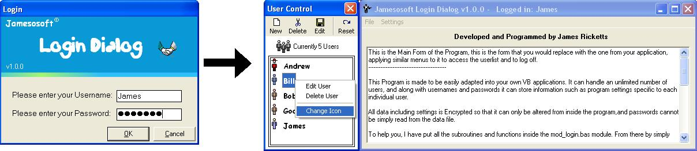



## Multi User Login Interface \(Use with ANY PROGRAM\)

### Description

This is a multi user login interface.

It has the ability to edit users, Logoff, and store different user settings for your program.

All data is encrypted and it has a very nice graphical interface.

This program can be very easily adapted for use in any program.

There are 2 versions contained in the zip file. Use the Graphical version which uses the Listview and Imagelist controls from the Microsoft Windows Common Controls VB6.0 (sp4). This is the much better looking version. If this fails and you do not have the controls use the non-graphical version with NO extra controls used, but all the same functions.

NB. THE DEFAULT AUTHORISATION PASSWORD IS "BOB"
 
### More Info
 

             |
---                |---
**Submitted On**   |2003-01-12 01:10:58
**By**             |[James Ricketts](https://github.com/Planet-Source-Code/PSCIndex/blob/master/ByAuthor/james-ricketts.md)
**Level**          |Beginner
**User Rating**    |5.0 (30 globes from 6 users)
**Compatibility**  |VB 5\.0, VB 6\.0
**Category**       |[Complete Applications](https://github.com/Planet-Source-Code/PSCIndex/blob/master/ByCategory/complete-applications__1-27.md)
**World**          |[Visual Basic](https://github.com/Planet-Source-Code/PSCIndex/blob/master/ByWorld/visual-basic.md)
**Archive File**   |[Multi\_User1527781122003\.zip](https://github.com/Planet-Source-Code/james-ricketts-multi-user-login-interface-use-with-any-program__1-42351/archive/master.zip)

